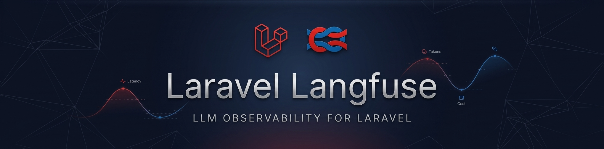

<p></p>

# Laravel Langfuse

[](https://github.com/axyr/laravel-langfuse/actions/workflows/ci.yml)

How much did your LLM calls cost yesterday? Which prompts are slow? Are your RAG answers actually good?

[Langfuse](https://langfuse.com) answers these questions. This package gives your Laravel app a clean way to send traces, generations, scores, and prompts to Langfuse - the open-source LLM observability platform.

```php
use Axyr\Langfuse\LangfuseFacade as Langfuse;

$trace = Langfuse::trace(new TraceBody(name: 'chat-request'));

$generation = $trace->generation(new GenerationBody(
    name: 'chat',
    model: 'gpt-4',
    input: [['role' => 'user', 'content' => 'Hello!']],
));

// After the LLM responds:
$generation->end(
    output: 'Hi there!',
    usage: new Usage(input: 12, output: 85, total: 97),
);
```

Events are batched and flushed automatically. Zero-code auto-instrumentation is available for [Laravel AI](https://laravel.com/docs/ai-sdk), [Prism](https://github.com/prism-php/prism), and [Neuron AI](https://github.com/neuron-core/neuron-ai).

## Features

- **Full observability** - traces, spans, generations, events, and scores with automatic parent-child nesting
- **Prompt management** - fetch, cache, compile, create, and list prompts with stale-while-revalidate caching
- **Auto-instrumentation** - zero-code tracing for Prism, Laravel AI, and Neuron AI
- **Automatic batching** - events queued and sent in batches, with optional async dispatch via Laravel queues
- **Production-ready** - Octane compatible, graceful degradation, auto-flush on shutdown, testing fakes

## Installation

Requires PHP 8.2+ and Laravel 12 or 13.

```bash
composer require axyr/laravel-langfuse
```

Add your Langfuse credentials to `.env`:

```env
LANGFUSE_PUBLIC_KEY=pk-lf-...
LANGFUSE_SECRET_KEY=sk-lf-...
```

## Documentation

Full documentation in the [`docs/`](docs/README.md) directory:

- [Configuration](docs/configuration.md) - env vars, config publishing
- [Tracing](docs/tracing.md) - traces, updating, nesting observations
- [Generations](docs/generations.md) - LLM generation tracking, usage and cost
- [Spans and Events](docs/spans-and-events.md) - non-LLM work, event logging
- [Scores](docs/scores.md) - numeric, boolean, categorical scores
- [Prompt Management](docs/prompt-management.md) - fetch, cache, compile, create
- [Integrations](docs/integrations/prism.md) - Prism, Laravel AI, Neuron AI
- [Middleware](docs/middleware.md) - request trace context
- [Batching and Flushing](docs/batching-and-flushing.md) - flush control, queued dispatch
- [Testing](docs/testing.md) - fakes and assertions
- [Architecture](docs/architecture.md) - system diagram, Octane compatibility

## Contributing

Contributions welcome. Open an issue first to discuss what you'd like to change.

```bash
composer test        # Run tests
composer pint        # Fix code style
```

## License

MIT