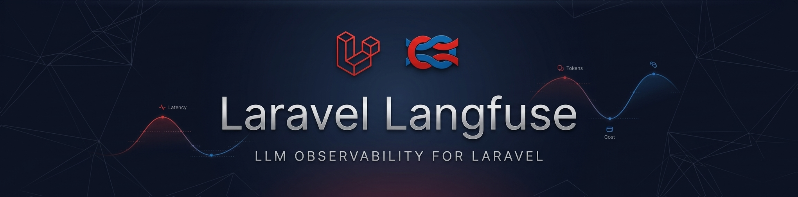

<p></p>

# Laravel Langfuse

[](https://github.com/axyr/laravel-langfuse/actions/workflows/ci.yml)
[](https://phpstan.org/)
[](https://www.php.net/)
[](https://laravel.com)
[](https://opensource.org/licenses/MIT)

[Langfuse](https://langfuse.com) is an open-source observability platform for LLM applications. It gives you a dashboard to trace every LLM call, track token usage and costs, manage prompt versions, and evaluate output quality - all in one place. It's self-hostable or available as a managed cloud service.

This package connects your Laravel app to Langfuse. Send traces, generations, scores, and prompts with a clean, idiomatic API - or let the auto-instrumentation do it for you.

```php
use Axyr\Langfuse\LangfuseFacade as Langfuse;

$trace = Langfuse::trace(new TraceBody(name: 'chat-request'));

$generation = $trace->generation(new GenerationBody(
    name: 'chat',
    model: 'gpt-4',
    input: [['role' => 'user', 'content' => 'Hello!']],
));

// After the LLM responds:
$generation->end(
    output: 'Hi there!',
    usage: new Usage(input: 12, output: 85, total: 97),
);

$trace->end(output: 'Hi there!');
```

Observations are batched and flushed automatically. Zero-code auto-instrumentation is available for [Laravel AI](https://laravel.com/docs/ai-sdk), [Prism](https://github.com/prism-php/prism), and [Neuron AI](https://github.com/neuron-core/neuron-ai).

<p></p>

## Features

- **Full observability** - traces, spans, generations, events, and scores with automatic parent-child nesting
- **Read & evaluate** - query scores, observations, and metrics, and manage datasets, dataset items and experiments to build evaluation workflows ([read API](docs/querying.md))
- **Prompt management** - fetch, cache, compile, create, and list prompts with stale-while-revalidate caching
- **Auto-instrumentation** - zero-code tracing for Prism, Laravel AI, and Neuron AI
- **Automatic batching** - completed observations queued and sent in batches over OTLP, with optional async dispatch via Laravel queues
- **Production-ready** - Octane compatible, graceful degradation, auto-end and auto-flush on shutdown, testing fakes

## Installation

Requires PHP 8.2+ and Laravel 12 or 13. No PHP extensions beyond the core `hash`, `random_bytes` and `json`; `zlib` is only needed when you turn on `LANGFUSE_COMPRESSION`.

**Langfuse compatibility.** Since 0.4.0 the package writes traces over OpenTelemetry (OTLP) and reads back from the v2/v3 APIs:

| Surface | Requirement |
|---|---|
| Tracing | Langfuse Cloud (v3 and v4) and self-hosted **3.22.0+** |
| Scores (write and read) | Langfuse Cloud (v3 and v4) and self-hosted v3+ |
| Observations, metrics and experiments read APIs | **Langfuse v4** |

Langfuse Cloud removes the deprecated ingestion and read endpoints on **2026-11-16**. Upgrading to 0.4.0 before that date is required; see the [upgrade guide](docs/upgrade-to-0.4.md).

```bash
composer require axyr/laravel-langfuse
```

Add your Langfuse credentials to `.env`:

```env
LANGFUSE_PUBLIC_KEY=pk-lf-...
LANGFUSE_SECRET_KEY=sk-lf-...
```

Optionally publish the configuration file:

```bash
php artisan vendor:publish --tag=langfuse-config
```

## Examples

Working example projects for each integration:

- [Laravel AI + Langfuse](https://github.com/axyr/laravel-langfuse-ai-examples) - agents, tools, streaming, and scoring with the official Laravel AI SDK
- [Prism + Langfuse](https://github.com/axyr/laravel-langfuse-prism-examples) - text, structured output, and streaming with Prism
- [Neuron AI + Langfuse](https://github.com/axyr/laravel-langfuse-neuron-ai-examples) - agent workflows with Neuron AI

## Documentation

Full documentation in the [`docs/`](docs/README.md) directory:

- [Configuration](docs/configuration.md) - env vars, config publishing
- [Tracing](docs/tracing.md) - traces, updating, nesting observations
- [Generations](docs/generations.md) - LLM generation tracking, usage and cost
- [Spans and Events](docs/spans-and-events.md) - non-LLM work, event logging
- [Scores](docs/scores.md) - numeric, boolean, categorical, text and correction scores
- [Prompt Management](docs/prompt-management.md) - fetch, cache, compile, create
- [Querying (read API)](docs/querying.md) - read scores/observations, metrics, and the experiment workflow
- [Integrations](docs/integrations/prism.md) - Prism, Laravel AI, Neuron AI
- [Middleware](docs/middleware.md) - request trace context
- [Batching and Flushing](docs/batching-and-flushing.md) - flush control, queued dispatch
- [Testing](docs/testing.md) - fakes and assertions
- [Architecture](docs/architecture.md) - system diagram, Octane compatibility
- [Troubleshooting](docs/troubleshooting.md) - Langfuse v4 tracing, common issues
- [Upgrading to 0.4](docs/upgrade-to-0.4.md) - what changed for Langfuse v4 and what you need to do

See the [Changelog](CHANGELOG.md) for release history.

## Contributing

Contributions welcome. Open an issue first to discuss what you'd like to change.

```bash
composer test        # Run tests
composer pint        # Fix code style
```

## License

MIT

## Author

Built by [Martijn van Nieuwenhoven](https://martijnvannieuwenhoven.com) - Laravel developer specializing in AI integrations and observability tooling.