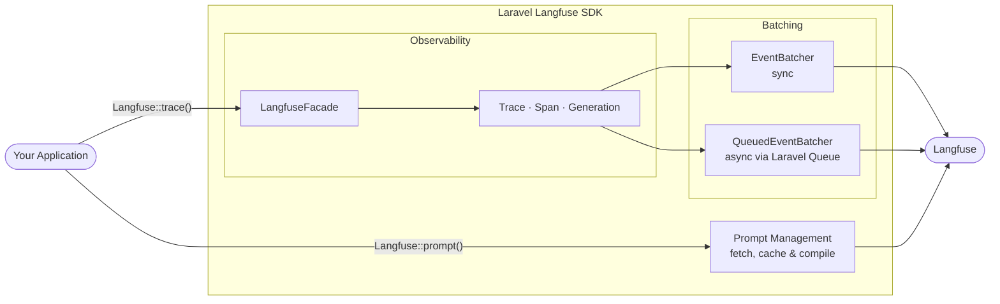

[Back to documentation](README.md)

# Architecture

All DTOs are immutable readonly classes with auto-generated IDs and timestamps.

The SDK uses `EventBatcher` (sync) by default. Set `LANGFUSE_QUEUE` to switch to `QueuedEventBatcher`, which dispatches jobs instead of making HTTP calls directly.

API and batching failures are caught and logged. They never propagate exceptions to your application.

## Octane compatibility

The `EventBatcher` and `LangfuseClient` use scoped bindings that reset per request. No event leakage between requests.

Works out of the box with Octane, RoadRunner, and FrankenPHP. No additional configuration needed.

---

Previous: [Testing](testing.md)
