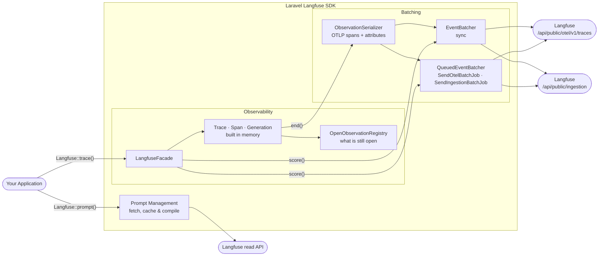

[Back to documentation](README.md)

# Architecture

```mermaid
graph LR
    App(["Your Application"])

    subgraph SDK ["Laravel Langfuse SDK"]
        direction LR

        subgraph Observability [" Observability "]
            direction TB
            Facade["LangfuseFacade"]
            Trace["Trace · Span · Generation\nbuilt in memory"]
            Registry["OpenObservationRegistry\nwhat is still open"]
            Facade --> Trace
            Trace --> Registry
        end

        subgraph Batching [" Batching "]
            direction TB
            Serializer["ObservationSerializer\nOTLP spans + attributes"]
            EB["EventBatcher\nsync"]
            QEB["QueuedEventBatcher\nSendOtelBatchJob · SendIngestionBatchJob"]
            Serializer --> EB & QEB
        end

        Prompt["Prompt Management\nfetch, cache & compile"]
    end

    OTLP(["Langfuse\n/api/public/otel/v1/traces"])
    Ingest(["Langfuse\n/api/public/ingestion"])
    Read(["Langfuse read API"])

    App -->|"Langfuse::trace()"| Facade
    App -->|"Langfuse::prompt()"| Prompt
    Trace -->|"end()"| Serializer
    Facade -->|"score()"| EB & QEB
    EB & QEB --> OTLP & Ingest
    Prompt --> Read
```

All DTOs are immutable readonly classes with auto-generated IDs and timestamps.

## Export once

Langfuse v4 is append-only: re-sending a span ID creates a duplicate row rather than updating the original. So an observation is assembled in memory and handed to the batcher exactly once, when it ends. `OpenObservationRegistry` tracks what is still open so `Langfuse::shutdown()` - and the application terminate hook - can end it before the process goes away.

`ObservationSerializer` turns each completed observation plus its live `TraceContext` into one OTLP span. Reading the trace context at serialisation time is what lets trace-level attributes (user, session, tags, metadata) land on every span of the trace, even values set after a child already ended.

## Two endpoints

Observations go to the OTLP endpoint as OTLP/JSON; scores stay on the ingestion endpoint as `score-create` events, which v4 keeps supporting. `ScoreApiClient` owns both the score reads and the score writes, so moving them to `POST /api/public/scores` later is a change to one file.

The SDK uses `EventBatcher` (sync) by default. Set `LANGFUSE_QUEUE` to switch to `QueuedEventBatcher`, which dispatches `SendOtelBatchJob` and `SendIngestionBatchJob` instead of making HTTP calls directly.

API and batching failures are caught and logged. They never propagate exceptions to your application.

## Octane compatibility

The `EventBatcher`, `OpenObservationRegistry` and `LangfuseClient` use scoped bindings that reset per request. No leakage between requests.

Works out of the box with Octane, RoadRunner, and FrankenPHP. No additional configuration needed.

---

Previous: [Testing](testing.md)
